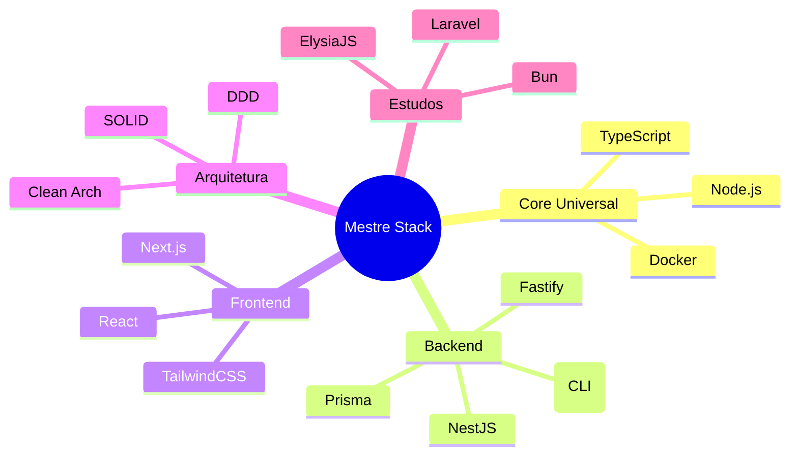

---
tags:
  - Guia
---

# 📂 Índice: `=this.file.name`

> [!ABSTRACT] Sobre esta pasta
> Descreva aqui o conteúdo e os objetivos deste diretório.

---

## 🛠️ Tech Radar & Stack
> [!SUMMARY] Tecnologias do Ecossistema
> Visualização estratégica das tecnologias, padrões e referências técnicas do workspace.



### 🟢 Adote (Core Stack)
Tecnologias maduras e validadas em produção.

| Tecnologia | Categoria | Projetos de Referência (Exemplos) |
| :--- | :--- | :--- |
| **TypeScript** | Lang | *Universal* |
| **Node.js** | Runtime | *Universal* |
| **NestJS** | Framework | [[01_Projetos/Nestcleanarchitecture/Nestcleanarchitecture|NestCleanArch]], [[01_Projetos/DesafioGdash202502/DesafioGdash202502|G-Dash]] |
| **Next.js** | Web | [[01_Projetos/SaasRbacSystem/SaasRbacSystem|SaaS RBAC]], [[01_Projetos/DevstoreEcom/DevstoreEcom|DevStore]] |
| **Fastify** | Framework | [[01_Projetos/GympassApp/GympassApp|GymPass App]] |
| **Prisma ORM** | Data | [[01_Projetos/GympassApp/GympassApp|GymPass App]], [[01_Projetos/Nestcleanarchitecture/Nestcleanarchitecture|NestCleanArch]] |
| **TailwindCSS** | UI | [[01_Projetos/Tailwindmastery/Tailwindmastery|TailwindMastery]], [[01_Projetos/SaasRbacSystem/SaasRbacSystem|SaaS RBAC]] |
| **Docker** | Infra | [[01_Projetos/MestreCLI/MestreCLI|MestreCLI]] |

### 🔵 Avalie (Promissor)
Tecnologias em análise ou uso específico.

| Tecnologia | Categoria | Projetos de Referência |
| :--- | :--- | :--- |
| **Bun** | Runtime | [[01_Projetos/Apiwithbun/Apiwithbun|ApiWithBun]] |
| **Go (Golang)** | CLI/Sys | [[01_Projetos/MestreCLI/MestreCLI|MestreCLI]] |
| **Vite** | Build | [[01_Projetos/DesafioGdash202502/DesafioGdash202502|G-Dash Frontend]] |
| **Drizzle ORM** | Data | [[01_Projetos/Apiwithbun/Apiwithbun|ApiWithBun]] |

### 🏗️ Arquitetura & Padrões
| Padrão | Projetos de Referência |
| :--- | :--- |
| **Clean Architecture** | [[01_Projetos/CleandddCore/CleandddCore|CleanDDD]], [[01_Projetos/Nestcleanarchitecture/Nestcleanarchitecture|NestCleanArch]] |
| **DDD** | [[01_Projetos/CleandddCore/CleandddCore|CleanDDD]] |
| **Modular Monolith** | [[01_Projetos/DesafioGdash202502/DesafioGdash202502|G-Dash]] |

### 🎯 Roadmap de Aprendizado
> **Foco Atual:** Consolidação de Microsserviços com NestJS e expansão para ecossistema PHP (Laravel).

---

## 🗺️ Navegação da Pasta
```dataview
LIST FROM "" WHERE file.folder = this.file.folder AND file.name != this.file.name
```

---
#Dashboard #Indice

%% Zoottelkeeper: Beginning of the autogenerated index file list  %%
- 📄 [[01_Projetos/ApiWithBun 1|ApiWithBun 1]]
- 📄 [[01_Projetos/ApiWithBun|ApiWithBun]]
- 📄 [[01_Projetos/GDashChallenge|GDashChallenge]]
- 🗂️ [[01_Projetos/Apiwithbun/Apiwithbun|Apiwithbun]]
- 🗂️ [[01_Projetos/Calligraphytrainingapp/Calligraphytrainingapp|Calligraphytrainingapp]]
- 🗂️ [[01_Projetos/Callscheduleapp/Callscheduleapp|Callscheduleapp]]
- 🗂️ [[01_Projetos/CleandddCore/CleandddCore|CleandddCore]]
- 🗂️ [[01_Projetos/Content_Planning/Content_Planning|Content_Planning]]
- 🗂️ [[01_Projetos/Dailylogger/Dailylogger|Dailylogger]]
- 🗂️ [[01_Projetos/DesafioGdash202502/DesafioGdash202502|DesafioGdash202502]]
- 🗂️ [[01_Projetos/DesignsystemLib/DesignsystemLib|DesignsystemLib]]
- 🗂️ [[01_Projetos/Devfinance/Devfinance|Devfinance]]
- 🗂️ [[01_Projetos/DevstoreEcom/DevstoreEcom|DevstoreEcom]]
- 🗂️ [[01_Projetos/energy-tracker/energy-tracker|energy-tracker]]
- 🗂️ [[01_Projetos/FelipeRS_Profile/FelipeRS_Profile|FelipeRS_Profile]]
- 🗂️ [[01_Projetos/FelipeWebsite/FelipeWebsite|FelipeWebsite]]
- 🗂️ [[01_Projetos/FindyourduoApp/FindyourduoApp|FindyourduoApp]]
- 🗂️ [[01_Projetos/Focustimechallenge/Focustimechallenge|Focustimechallenge]]
- 🗂️ [[01_Projetos/Foodcourtapp/Foodcourtapp|Foodcourtapp]]
- 🗂️ [[01_Projetos/Gdashchallenge/Gdashchallenge|Gdashchallenge]]
- 🗂️ [[01_Projetos/GeminivisionAi/GeminivisionAi|GeminivisionAi]]
- 🗂️ [[01_Projetos/GympassApp/GympassApp|GympassApp]]
- 🗂️ [[01_Projetos/HealhThesis/HealhThesis|HealhThesis]]
- 🗂️ [[01_Projetos/Igniteshop/Igniteshop|Igniteshop]]
- 🗂️ [[01_Projetos/ImagereaderTool/ImagereaderTool|ImagereaderTool]]
- 🗂️ [[01_Projetos/JourneyPlannner/JourneyPlannner|JourneyPlannner]]
- 🗂️ [[01_Projetos/LogicPocketKnife_CLI/LogicPocketKnife_CLI|LogicPocketKnife_CLI]]
- 🗂️ [[01_Projetos/Mangagenai/Mangagenai|Mangagenai]]
- 🗂️ [[01_Projetos/MestreCLI/MestreCLI|MestreCLI]]
- 🗂️ [[01_Projetos/MestreJS_Template/MestreJS_Template|MestreJS_Template]]
- 🗂️ [[01_Projetos/MestreJSArchitect/MestreJSArchitect|MestreJSArchitect]]
- 🗂️ [[01_Projetos/Movienotesapi/Movienotesapi|Movienotesapi]]
- 🗂️ [[01_Projetos/Nestcleanarchitecture/Nestcleanarchitecture|Nestcleanarchitecture]]
- 🗂️ [[01_Projetos/Nestcleanrocketseat/Nestcleanrocketseat|Nestcleanrocketseat]]
- 🗂️ [[01_Projetos/NextjsFundamentals/NextjsFundamentals|NextjsFundamentals]]
- 🗂️ [[01_Projetos/NodejsStudies/NodejsStudies|NodejsStudies]]
- 🗂️ [[01_Projetos/NotesApp/NotesApp|NotesApp]]
- 🗂️ [[01_Projetos/Pg/Pg|Pg]]
- 🗂️ [[01_Projetos/Pizzashoppingapi/Pizzashoppingapi|Pizzashoppingapi]]
- 🗂️ [[01_Projetos/PizzashopWeb/PizzashopWeb|PizzashopWeb]]
- 🗂️ [[01_Projetos/PizzaSmart_Specs/PizzaSmart_Specs|PizzaSmart_Specs]]
- 🗂️ [[01_Projetos/Portfolio_Docs/Portfolio_Docs|Portfolio_Docs]]
- 🗂️ [[01_Projetos/Reactstatemanagement/Reactstatemanagement|Reactstatemanagement]]
- 🗂️ [[01_Projetos/Restaurantsapp/Restaurantsapp|Restaurantsapp]]
- 🗂️ [[01_Projetos/SaasRbacSystem/SaasRbacSystem|SaasRbacSystem]]
- 🗂️ [[01_Projetos/Serverlesstesting/Serverlesstesting|Serverlesstesting]]
- 🗂️ [[01_Projetos/SmartpizzaApp/SmartpizzaApp|SmartpizzaApp]]
- 🗂️ [[01_Projetos/Tailwindmastery/Tailwindmastery|Tailwindmastery]]
- 🗂️ [[01_Projetos/Taskmanagementapp/Taskmanagementapp|Taskmanagementapp]]
- 🗂️ [[01_Projetos/TechDesk_SaaS/TechDesk_SaaS|TechDesk_SaaS]]
- 🗂️ [[01_Projetos/Templates/Templates|Templates]]
- 🗂️ [[01_Projetos/Webdevchallenge/Webdevchallenge|Webdevchallenge]]
- 🗂️ [[01_Projetos/YourhotelApp/YourhotelApp|YourhotelApp]]
%% Zoottelkeeper: End of the autogenerated index file list  %%
